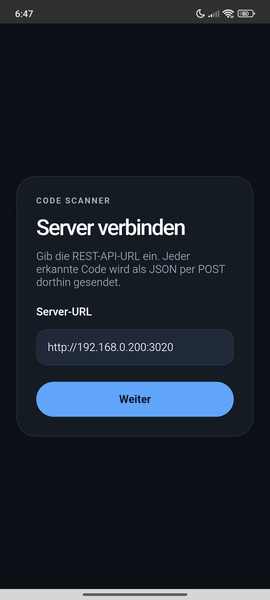
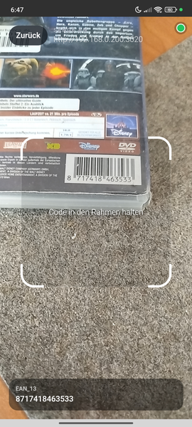
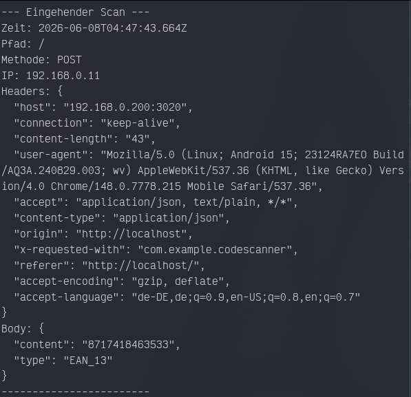

# Code Scanner

A universal code (EAN, ISBN, QR, etc.) scanner that sends the data to any server. 

## Screenshots
| Select Server Screen | Scan Code Screen | Test Server |
| --- | --- | --- |
|  |  |  |